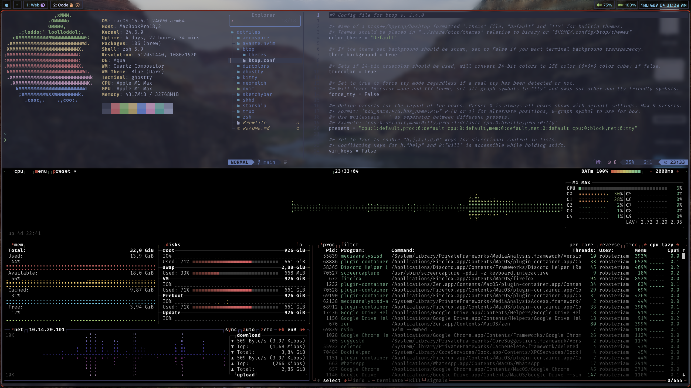
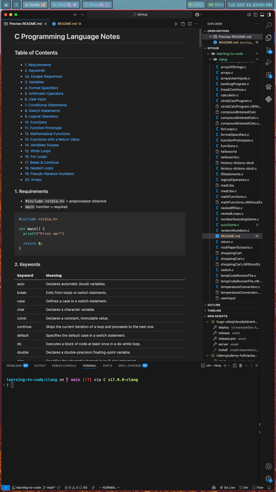

# **Robin's Dotfiles**

These are the personal configuration files for my macOS setup, designed for akeyboard driven workflow. This is a work in progress and will constantly change over time. I'm having fun, enjoying the process and learning.

---

## **Key Features**

- **Keyboard-Centric Workflow:** Navigate applications, windows, and the browser using familiar Vim motions.
- **Aesthetic & Cohesive:** A simple setup unified by the **Catppuccin** color theme across the terminal, editor, and window manager.
- **Seamless Multi-Monitor Support:** A custom **Aerospace** configuration to manage workspaces.
- **Simple & Effective Tools:** Aliases and a clean terminal setup.

---

### **Prerequisites**

This configuration is specifically tailored for **macOS** and relies on [**Homebrew**](https://brew.sh/) as its package manager. Please ensure you have it installed before proceeding.

---

### **Packages**

Clicking on the package name will open their GitHub or Web page.

| Tool                                                                                                                  | Description                                                                  | Configuration           |
| :-------------------------------------------------------------------------------------------------------------------- | :--------------------------------------------------------------------------- | :---------------------- |
| [**Aerospace**](github.com/nikitabobko/AeroSpace)                                                                     | A tiling window manager                                                      | `aerospace.toml`        |
| [**dircolors**](https://github.com/gibbling/dircolors)                                                                | Colorizes `ls` output                                                        | `dircolors`             |
| [**Ghostty**](https://ghostty.org/docs)                                                                               | A modern terminal emulator                                                   | `ghostty.conf`          |
| [**Kitty**](https://sw.kovidgoyal.net/kitty/)                                                                         | A fast, feature-rich terminal emulator                                       | `kitty.conf`            |
| [**neofetch**](https://github.com/dylanaraps/neofetch) or [**fastfetch**](https://github.com/fastfetch-cli/fastfetch) | Displays system information                                                  | `config.conf`           |
| [**neovim**](https://neovim.io/)                                                                                      | The powerful editor, configured with [**LazyVim**](https://www.lazyvim.org/) | `init.lua`, `lua`       |
| [**Raycast**](https://www.raycast.com/)                                                                               | A fast launcher with powerful integrations                                   | `script_commands`       |
| [**sketchybar Lua**](https://github.com/FelixKratz/SbarLua)                                                           | A highly customizable macOS status bar                                       | `sketchybarrc`          |
| [**starship**](https://starship.rs/)                                                                                  | The prompt for any shell                                                     | `starship.toml`         |
| [**tmux**](https://github.com/tmux/tmux)                                                                              | A terminal multiplexer                                                       | `tmux.conf`             |
| [**zsh**](https://ohmyz.sh/)                                                                                          | The default shell                                                            | `.zshrc`, `aliases.zsh` |
| [**Vimium**](https://vimium.github.io/)                                                                               | A Chrome/Firefox extension for Vim-like browsing                             | `vimium-c-config`       |

---

### **Installation**

This repository uses **[GNU Stow](https://www.gnu.org/software/stow/)** to manage symbolic links. This approach keeps the repository clean and allows you to symlink only the dotfiles you need.

1. **Clone the repository:**

   ```bash
   git clone https://github.com/your-username/dotfiles.git ~/dotfiles
   ```

2. **Install the necessary packages via Homebrew:**

   ```bash
   brew bundle --file ~/dotfiles/Brewfile
   ```

3. **Navigate to the dotfiles directory:**

   ```bash
   cd ~/dotfiles
   ```

4. **Use `stow` to create symbolic links for the entire directory:**

   ```bash
   stow .
   ```

---

### **Screenshots**



